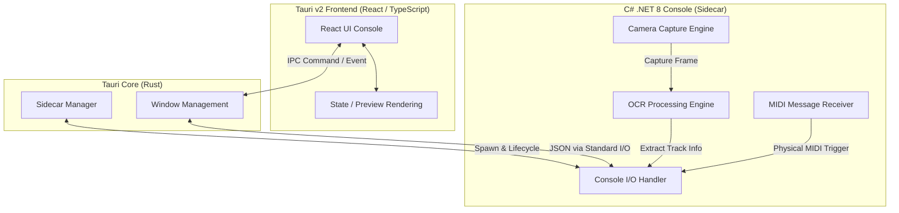

# Synapse (LiveEvent Visualizer)

> **今流れている曲を、フロアへ視覚的に。**
> DJブースという「暗所・リアルタイム・ノンストップ」の極限環境に耐えうる、AI共同開発思想に基づいた超軽量・高耐久なVisual Share System。

---

## 🌌 1. プロダクトの背景と目的 (Why)

### 「今かかっている曲を、フロアに共有する」という明確なユースケース
本プロダクトは、LiveEventにおける、「今かかっている曲の情報をフロアと共有する」という演出を技術的に支援・実現するために開発されました。
DJがプレイするレコードの盤面やジャケット、CDJ等をカメラで撮影し、OCR（光学文字認識）によってテキスト抽出を行ったり、カメラ映像そのものを表示することで、リアルタイムに観客へ曲情報を届けます。

### DJブースという極限の動作環境
DJブースは一般的なPCの稼働環境とは異なり、非常に過酷な制約が存在します。
* **暗所（極端なローライト）**: キーボードやマウスによる誤操作が起きやすく、暗闇でも手探りで確実に入力できる直感的なUI/UXが必要。そのため、本システムでは物理MIDIコントローラーによる操作を標準としています。
* **リアルタイム・ノンストップ**: 数時間に及ぶイベント中、メモリリークやクラッシュによるシステム停止は許されません。また、DJの曲切り替えに瞬時に追従する超低遅延なレスポンスが要求されます。

---

## ⚡ 2. 尖ったアーキテクチャの選定理由 (How)

本システムは、**Tauri v2 (Rust) + React (TypeScript) + C# (.NET 8) Console (Sidecar)** という、一見非常にユニークで尖ったスタックを採用しています。これには明確な技術的合理性があります。



### なぜこの技術スタックなのか？
1. **圧倒的に軽量なUI（Tauri v2 × React）**
   * Electron等と比較して、TauriはOSネイティブのWebViewを利用するため、メモリフットプリントや起動速度が圧倒的に優れています。React + Tailwind CSSによる洗練されたモダンUIを、最小限のシステム負荷で動作させることができます。
2. **重厚なシステム処理に強いバックエンド（C# .NET 8）**
   * カメラの映像キャプチャ（OpenCV系）、マルチカメラ制御、OCRエンジン、低遅延なMIDIハードウェア入力の処理など、OSやハードウェアに密結合するロジックは、豊富なライブラリとマルチスレッド・非同期処理が極めて強力な C#（.NET 8）が担当します。

### Sidecarパターンによる「完全分離」と「JSON(stdio)通信」のメリット
* **高耐久なプロセス分離（Fault Tolerance）**
  * カメラデバイスの切断やMIDI機器の瞬断など、ハードウェア起因の例外はバックエンド（C#）内で完結し、UIプロセス（Tauri）へは波及しません。万が一C#側で例外が発生しても、UIはハングせず、安全に再接続やフォールバック処理を行えます。
* **レンダリングの滑らかさの担保**
  * UI描画スレッドと、カメラプレビューのデコード・OCR処理・物理入力検知といった重い処理が、OSレベルで異なるプロセスに分離されています。これにより、どんなに裏でOCR処理が走っても、Web UI側の表示やアニメーションが一切コマ落ちしません。
* **標準入出力（stdio）を通じたシンプルなJSON通信**
  * 通信プロトコルとして複雑なTCP/IPCや共有メモリを使用せず、標準的なI/O（`Console.ReadLine` / `Console.WriteLine`）で動作するJSONストリームを採用。これによりプラットフォーム依存を徹底的に排除し、単体テストやモックを用いたシミュレーションが極めて容易になっています。

---

## 🤖 3. 【超重要】AI駆動開発 (AI-Driven Development) への最適化

本プロジェクトの設計思想において最も特徴的なのは、**「AIエージェントを単なるコード生成機ではなく、アーキテクチャレベルからの『共同開発パートナー』として定義・最適化している点」**です。

> [!NOTE]
> このアプローチは、今後のソフトウェア開発における「AIと人間の協調」を具現化したものであり、開発生産性を劇的に向上させるための実証モデルでもあります。

### 仕様書コンテキストの統合設計
AIエージェントが開発時に迷子にならず、意図通りの高精度なコードを出力できるよう、仕様書（基本設計、詳細設計、インターフェース定義）を別々に分断せず、**「1つの連続したコンテキスト」**として読めるようにドキュメントを再構成しています（`doc/` ディレクトリ配下）。
これにより、UIの設計思想と、バックグラウンドでの通信プロトコルの関連性をAIが一気通貫で深く理解できるようになります。

### AIが「自律開発」しやすいアーキテクチャ
* **技術的契約（Interface）の徹底定義**
  * `03_Interfaces.md` にて、C#側とフロントエンドがやり取りするJSONスキーマやC#の `interface`、`record` の形状を厳格に定義。
  - この「型による壁」を設けることで、AIエージェントは「通信の相手側がどうなっているか」に悩むことなく、各プロセスの内部ロジックやコンポーネントを独立して完璧に組み立てることができます。
* **自律テスト＆自己修正のループ**
  * C#バックエンドはHeadlessなコンソールアプリケーションとして設計されているため、UIを持たず、AIがターミナルからテストコード（`04_TestSpecification.md`）を実行しやすく、エラーが発生した際も自律的にログを解析して自己修正できる環境を整えています。

---

## 🔮 4. 今後の展望と改善サイクル

「Synapse」は、一度作って終わりのシステムではありません。実際の現場（イベント）での運用を経て、進化し続ける「プロダクト」です。

```
[実戦投入 (LiveEvent)] ──(現場の課題・発見)──> [GitHub Issue 起票]
       ▲                                            │
       │                                       (課題のインプット)
       │                                            ▼
[デプロイ・動作確認] <───(コード修正・PR)─── [AIエージェントによる開発]
```

### GitHub Issue を活用した「AI共生型」の改善ループ
1. **現場での課題抽出**: 実際のDJブースで発生した「照明の反射によるOCR誤判定」「特定MIDIコントローラーとの相性」「操作の動線上の違和感」などを、GitHubのIssueとして可視化・起票します。
2. **AIによる自律的アップデート**: 起票されたIssueをAIエージェントが読み込み、既存のコンテキスト仕様書とコードを照らし合わせながら、自律的に機能拡張やバグ修正のコードを記述。プルリクエストを作成します。
3. **継続的なデリバリー**: 人間はコードレビューと実機検証に集中し、より素早く、かつ安全にプロダクトを最高の状態へアップデートし続けます。

---

## 📂 5. ディレクトリ構造

```text
Synapse/
├── doc/                        # AI駆動開発用に最適化された統合仕様書
│   ├── 00_UseCase.md          # ユースケース定義書
│   ├── 01_Requirement.md      # 要件定義書
│   ├── 02_DetailedDesign.md   # ソフトウェア基本・詳細設計書 (AI Context最適化)
│   ├── 03_Interfaces.md       # インターフェース定義書 (技術的契約)
│   └── 04_TestSpecification.md# テスト仕様書 & 受入基準
├── src-tauri/                  # Tauri v2 (Rust Core) プロジェクト
│   └── tauri.conf.json         # Sidecarプロセスの定義・ライフサイクル設定
├── Synapse.Core/               # C# (.NET 8) Sidecar プロジェクト
│   ├── Program.cs              # メインエントリーポイント (JSON IPCループ)
│   └── Synapse.Core.csproj
├── src/                        # Web フロントエンド (React + TypeScript)
│   ├── components/             # UIコンポーネント (カメラプレビュー、コントロール等)
│   └── App.tsx                 # メインロジック
├── package.json
└── README.md                   # 本ファイル
```

---

## 🚀 6. セットアップ & 起動方法

### 前提条件
* Node.js (v18+)
* .NET 8 SDK
* Rust ツールチェーン (`rustup`)

### 1. 依存関係のインストール
```bash
npm install
```

### 2. Sidecar (C#) のビルド
TauriがSidecarとして認識できるように、C#プロジェクトをビルドして特定のターゲットディレクトリに配置します（各OS用の実行バイナリ名にリネームします）。

### 3. 開発モードでの起動
```bash
npm run tauri dev
```
これで、TauriのウィンドウとC#のSidecarプロセスが自動的に連動して起動します。
