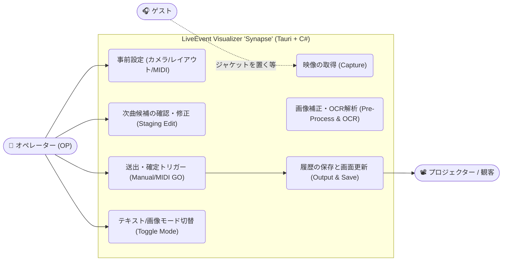

# Phase 0: ユースケース定義書 (Use Case Definition)

**Project Name:** LiveEvent Visualizer "Synapse"
**Version:** 2.1 (Tauri Architecture & Workflow Update)

### 1. アクター（システムの登場人物）
* **オペレーター (OP):** 本システムの主操作者。Web UIやMIDIコントローラーを操作し、表示の管理を行う。
* **ゲスト (ライブパフォーマー):** 楽曲をプレイし、情報ソースを提示する。本システムを直接は操作しない。
* **プロジェクター/観客:** 最終的なアウトプット（楽曲情報）を受け取る対象。

### 2. ユースケース図 (Mermaid)



### 3. 現場運用タイムライン（シーケンス）

```mermaid
sequence diagram
    autonumber
    actor DJ as ゲスト
    actor OP as オペレーター(OP)
    participant C# as C# Sidecar (Backend)
    participant UI as Tauri UI (Frontend)
    participant OBS as OBS Studio

    DJ->>カメラ: レコード/CDプレイヤー画面を設置
    Note over C# internally: 常時カメラストリームをキャプチャ & OCR解析
    C#->>UI: リアルタイムにプレビュー画像とOCR暫定結果を送信
    Note over OP: UI上でOCR結果の誤字やレイアウトを確認・修正(Staging)
    OP->>MIDIコントローラー: Pad 1 (GOトリガー) を押下
    MIDIコントローラー->>C#: NoteOn 受信
    C#->>UI: 確定コマンド送信 (GO, slotIndex)
    UI->>UI: 履歴リスト(Setlist Log)に追加 & 送出エリアを更新
    UI->>OBS: [画面キャプチャ] リアルタイムにプロジェクターへ送出
    
    Note over OP: OCRに誤字を発見した場合
    OP->>UI: 履歴リストの該当箇所をダブルクリックして手動修正
    UI->>UI: 送出エリアに即座に反映 (OBS側も即時更新)
    
    Note over OP: 曲を戻したい場合
    OP->>MIDIコントローラー: Pad 2 (Undoトリガー) を押下
    C#->>UI: 履歴ポインタを1つ戻すコマンド送信 (Undo)
    UI->>UI: 送出エリアの表示を1つ前の楽曲に切り替え
```